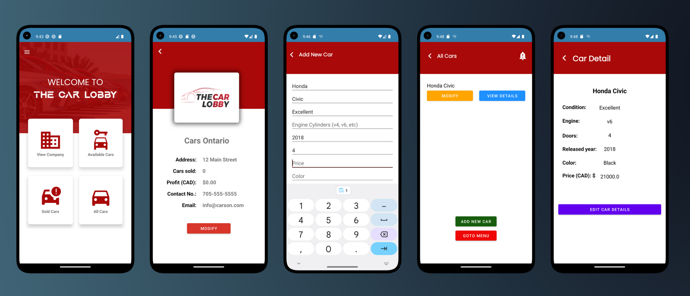

# Amazing Car Lobby App

Car Lobby is an unbelievably amazing Android application that lets users indulge in the sheer joy of browsing and managing car listings. It's not like there are already a million car apps out there, but hey, we thought the world needed one more!

## Table of Contents

- [Mind-Blowing Features](#mind-blowing-features)
- [Installation, Because Why Not](#installation-because-why-not)
- [Usage, Like It Matters](#usage-like-it-matters)
- [Contributing, If You Really Want To](#contributing-if-you-really-want-to)
- [License, Because Legal Stuff](#license-because-legal-stuff)

[]

## Mind-Blowing Features

- Adds new cars faster than you can say "vroom vroom."
- View a breathtaking list of cars with details that will make your jaw drop.
- Experience the mind-numbing excitement of marking cars as sold and pretending you're a billionaire.
- Oh, did we mention it uses the revolutionary technology called SQLite for data storage? Mind blown!

## Installation, Because Why Not

1. Like, who doesn't want to clone the repository? `git clone https://github.com/sakchhyat/CarLobby.git`
2. Open the project in Android Studio, because you obviously have nothing better to do.
3. Build and run the app on an Android emulator or a physical device. Brace yourself for the awesomeness!

## Usage, Like It Matters

1. Launch the app on your Android device. Trust us, it's going to change your life.
2. Gasp in amazement as you explore the car listings. They're just like any other car listings, but hey, we added a touch of magic.
3. Feel the adrenaline rush as you use the "Add Car" button to add new cars to the database. It's almost as exciting as watching paint dry.
4. Impress your friends by marking cars as sold. You're practically a used car salesman now.
5. Discover the hidden depths of the main menu and navigate between screens. It's like a treasure hunt, but with buttons.

## Contributing, If You Really Want To

If you have nothing better to do with your life, we'd love to see your contributions. Here's how you can join the madness:

1. Fork the repository because, hey, more forks mean more fun.
2. Create a new branch: `git checkout -b feature/your-feature`
3. Make your mind-blowing changes and commit them: `git commit -m 'Add your mind-blowing feature'`
4. Push to the branch: `git push origin feature/your-feature`
5. Open a pull request and prepare to have your mind blown even more.

